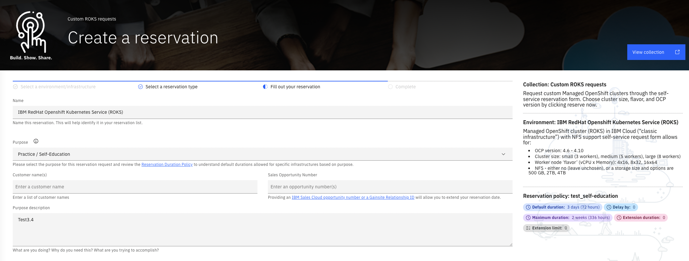
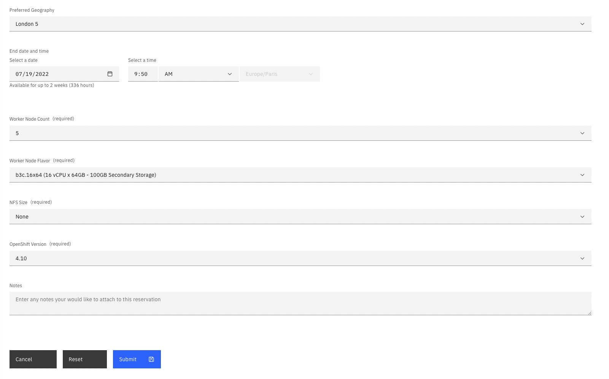
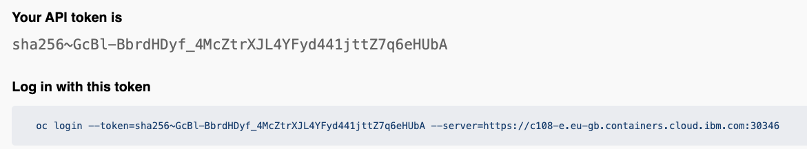
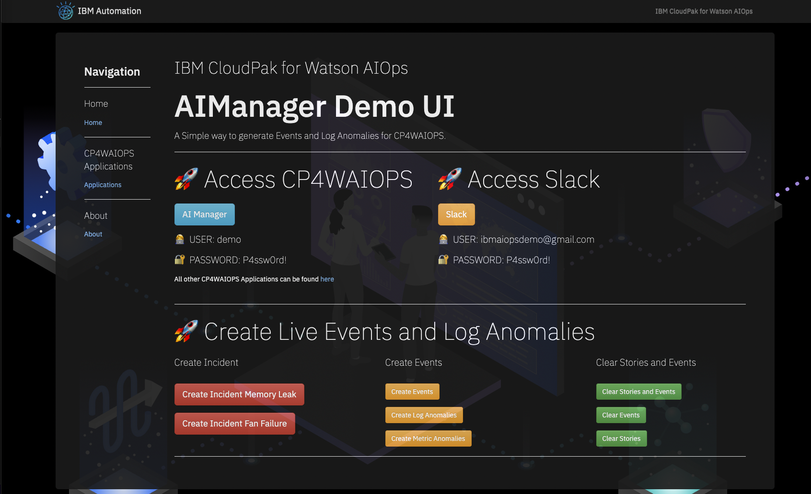

<center> <h2>CP4WatsonAIOps CP4WAIOPS</h2> </center>
<center> <h1>From Zero To Hero</h1> </center>


<center> <h3>Installation Training</h3> </center>


<center> ©2022 Niklaus Hirt / IBM </center>


<div style="page-break-after: always;"></div>


### ❗ THIS IS WORK IN PROGRESS
Please drop me a note on Slack or by mail nikh@ch.ibm.com if you find glitches or problems.


This is provided `as-is`:

* I'm sure there are errors
* I'm sure it's not complete
* It clearly can be improved


**❗This has been tested for the new CP4WAIOPS v3.5.0 release on OpenShift 4.10 on ROKS**


So please if you have any feedback contact me 

- on Slack: @niklaushirt or
- by Mail: nikh@ch.ibm.com


<div style="page-break-after: always;"></div>

---------------------------------------------------------------
# 1 Introduction
---------------------------------------------------------------

## 1.1 Training

In this Training you will learn how to install IBM CloudPak for AIOps and how to configure some basic functionnalities.

The idea is to provide an optimised way for you to learn CP4WAIOPS.

In the end you will have a demo environment containing the following components:

 - **AI Manager**
 - **AI Manager Demo Content**
    - **OpenLDAP** registered with AI Manager
    - **AWX** (Open Source Ansible Tower) with Playbooks and CP4WAIOPS Runbooks
    - **AI Models** for
      - Log Anomaly Detectiom
      - Metric Anomaly Detection
      - Event Grouping
      - Similar Incidents
      - Change Risk 
    - **Topology**
      - RobotShop Demo Installation
      - K8s Observer
      - RobotShop Application


## 1.2 Demo Setup - Explained

### 2.2.1 Basic Architecture

The environement (Kubernetes, Applications, ...) create logs that are being fed into a Log Management Tool (ELK in this case).


1. External Systems generate Alerts and send them into the AI Manager for Event Grouping.
1. At the same time AI Manager ingests the raw logs coming from the Log Management Tool (ELK) and looks for anomalies in the stream based on the trained model.
2. It also ingests Metric Data and looks for anomalies
1. If it finds an anomaly (logs and/or metrics) it forwards it to the Event Grouping as well.
1. Out of this, AI Manager creates a Story that is being enriched with Topology (Localization and Blast Radius) and with Similar Incidents that might help correct the problem.
1. The Story is then sent to Slack.
1. A Runbook is available to correct the problem but not launched automatically.

<div style="page-break-after: always;"></div>

### 2.2.2 Optimized Demo Architecture


For the this specific Demo environment:

* ELK is installed for you to kearn how to integrate it
* For Log Anomaly simulation we'll beusing pre-canned logs for the anomaly detection (inception)
* For Metrics, we'll be using pre-canned metric data for training and for the anomaly detection (inception)
* The Events will be created from pre-canned content that is injected into AI Manager
* There are also pre-canned ServiceNow Incidents as we don’t do the live integration with SNOW for this training
* The Webpages that are reachable from the Events are static and hosted on my GitHub
* The same goes for ServiceNow Incident pages if you don’t integrate with live SNOW


<div style="page-break-after: always;"></div>


---------------------------------------------------------------
# 2 Prerequisites
---------------------------------------------------------------


## 2.1 OpenShift requirements 

I installed the demo in a ROKS environment.

You'll need:

- ROKS 4.10
- 5x worker nodes Flavour `b3c.16x64` (so **16 CPU / 64 GB**)  ❗


You **might** get away with less if you don't install some components (Event Manager, ELK, Turbonomic,...) but no guarantee:

- Typically 4x worker nodes Flavour `b3c.16x64` _**for only AI Manager**_


## 2.2 Get a ROKS Cluster (IBMers and IBM Partners only)

IBMers can get a temporary one from [Techzone](https://techzone.ibm.com/collection/custom-roks-vmware-requests) (ususally valid for up to 8 days)

1. Create a cluster for `Practice/Self Education` if you don't have an Opportunity Number

	

<div style="page-break-after: always;"></div>

1. Select the maximum end date that fits your needs (you can extend the duration once after creation)

	
	
1. Fill-in the remaining fields

	1. Geograpy: prefer **Dallas or London** (others might be slower)
	2. Worker node count: **5**
	3. Flavour: **b3c.16x64** ❗
	4. OpenShift Version: **4.10**

	

1. Click `Submit`
	
1. Once the cluster is provisioned, don't forget to extend it to 8 days if needed.


## 2.3 Important remarks before you start ⚠️⚠️

Those are remarks to feedback and problem reports I got from the field.

Those scripts have been tested thoroughly on different environments and have proven to be VERY reliable.

If you think that you hit a problem:

* Make sure that you have provisioned a cluster with **5 worker nodes with 16 CPU and 64 GB** each (`b3c.16x64` - it's easy to select the wrong size). If you have Pods in `0/0` state verify the `Events`. If you get `Not enough CPU` then delete the cluster and provision the correct size.
* When deploying ROKS I usually use Dallas or London, they are the fastest. On other regions we have seen much worse performance - deployment can take 4-5 times longer.
* The complete installation takes about 2.5 to 8 hours depending on your region where you deployed ROKS to (see above).
* If you see Pods in `CrashLoop` or other error states, try to wait it out (this can be due to dependencies on other componenets that are not ready yet). Chances are that the deployment will eventually go through. If after 8h you are still stuck, ping me.
* **Select and use ONLY ONE of the scripts** below, depending on which components you want to install.


### ❗ So simply put be patient and make sure you have the correct size of cluster provisioned!

<div style="page-break-after: always;"></div>


---------------------------------------------------------------
# 3 Installing AI Manager
---------------------------------------------------------------

The official documentation can be found [here](https://www.ibm.com/docs/en/cloud-paks/cloud-pak-watson-aiops/3.5.0?topic=manager-starter-installation-cli).


## 3.1 Preparing to run commands

Befor continuing, you have to connect to your OpenShift Cluster.


1. Open your Openshift Web Console
1. Select `Copy Login Command`

	

1. Copy the `oc login ..` string

	

1. Open your terminal
1. Paste the `oc login ..` command from above
1. Clone the GitHub Repository into your directory of choice

	```
	git clone https://github.com/niklaushirt/cp4waiops-deployer.git
	```
	
1. Go to the deployer directory

	```
	cd cp4waiops-deployer
	```
	
Now you're good to start with the installation.


## 3.2 Installing the Catalog and Operator

### 3.2.1 Create the namespace (project)


1. Create a namespace called `cp4waiops`, by running the following command:

	```
	oc create namespace cp4waiops
	```


### 3.2.2 Create the OperatorGroup

1. Create the Operator group by running the following command:

	```yaml
	cat << EOF | oc apply -f -
	apiVersion: operators.coreos.com/v1
	kind: OperatorGroup
	metadata:
	  name: cp4waiops-operator-group
	  namespace: cp4waiops
	spec:
	  targetNamespaces:
	    - cp4waiops
	EOF
```

### 3.2.3 Create the entitlement key pull secret


1. Log in to [MyIBM Container Software Library](https://myibm.ibm.com/products-services/containerlibrary) with the IBMid.

2. In the *Entitlement keys* section, select **Copy key** to copy your entitlement key to the clipboard.

3. Run the following command:

   ```
   oc create secret docker-registry ibm-entitlement-key \
       --docker-username=cp\
       --docker-password=<entitlement-key> \
       --docker-server=cp.icr.io \
       --namespace=cp4waiops
   ```

    Where `<entitlement-key>` is the entitlement key that you copied in the previous step.


### 3.2.4 Create the catalog source

1. Run the following command to create the CatalogSource.

   ```yaml
   cat << EOF | oc apply -f -
   apiVersion: operators.coreos.com/v1alpha1
   kind: CatalogSource
   metadata:
     name: ibm-operator-catalog
     namespace: openshift-marketplace
   spec:
     displayName: ibm-operator-catalog
     publisher: IBM Content
     sourceType: grpc
     image: icr.io/cpopen/ibm-operator-catalog:latest
   EOF
   ```
   
1. Update the CatalogSource to always use the current image digest by running the following commands:

   ```
   IMGDIGEST=`oc get pods -n openshift-marketplace -l=olm.catalogSource=ibm-operator-catalog --no-headers -o=jsonpath="{.items[0].status.containerStatuses[0].imageID}" -n openshift-marketplace` && \
   oc patch catalogsource ibm-operator-catalog -n openshift-marketplace --type=json -p "[{ "op": "test", "path": "/spec/image", "value": "\"icr.io/cpopen/ibm-operator-catalog:latest\"" }, { "op": "replace", "path": "/spec/image", "value": "\"$IMGDIGEST\"" }]"
   ```


### 3.2.4 Install the CP4WAIOPS operator

1. Run the following command:
 
	```yaml
	cat << EOF | oc apply -f -
	apiVersion: operators.coreos.com/v1alpha1
	kind: Subscription
	metadata:
	  name: ibm-aiops-orchestrator
	  namespace: cp4waiops
	spec:
	  channel: v3.5
	  installPlanApproval: Automatic
	  name: ibm-aiops-orchestrator
	  source: ibm-operator-catalog
	  sourceNamespace: openshift-marketplace
	EOF
	```

### 3.2.5 Check Operator is ready

Verify that the Operator is running.

* Either run the following:
	
	```bash
	oc get csv -n cp4waiops                                                           
	```
	
	And you should see TODO entries with `Succeeded` state
	
	```bash
	NAME                                     DISPLAY                                            VERSION   REPLACES                                 PHASE
	aimanager-operator.v3.5.1                IBM Watson AIOps AI Manager                        3.5.1                                              Succeeded
	aiopsedge-operator.v3.5.1                IBM Watson AIOps Edge                              3.5.1                                              Succeeded
	asm-operator.v3.5.1                      IBM Netcool Agile Service Manager                  3.5.1                                              Succeeded
	elasticsearch-operator.5.5.3             OpenShift Elasticsearch Operator                   5.5.3                                              Succeeded
	ibm-aiops-ir-ai.v3.5.1                   IBM Watson AIOps Issue Resolution AI & Analytics   3.5.1                                              Succeeded
	ibm-aiops-ir-core.v3.5.1                 IBM Watson AIOps Issue Resolution Core             3.5.1                                              Succeeded
	ibm-aiops-ir-lifecycle.v3.5.1            IBM Cloud Pak for Watson AIOps Lifecycle           3.5.1                                              Succeeded
	ibm-aiops-orchestrator.v3.5.1            IBM Cloud Pak for Watson AIOps AI Manager          3.5.1                                              Succeeded
	ibm-automation-core.v1.3.11              IBM Automation Foundation Core                     1.3.11    ibm-automation-core.v1.3.10              Succeeded
	ibm-automation-elastic.v1.3.10           IBM Elastic                                        1.3.10    ibm-automation-elastic.v1.3.9            Succeeded
	ibm-automation-eventprocessing.v1.3.11   IBM Automation Foundation Event Processing         1.3.11    ibm-automation-eventprocessing.v1.3.10   Succeeded
	ibm-automation-flink.v1.3.10             IBM Automation Foundation Flink                    1.3.10    ibm-automation-flink.v1.3.9              Succeeded
	ibm-automation.v1.3.11                   IBM Automation Foundation                          1.3.11    ibm-automation.v1.3.10                   Succeeded
	ibm-cloud-databases-redis.v1.4.3         IBM Operator for Redis                             1.4.3     ibm-cloud-databases-redis.v1.4.2         Succeeded
	ibm-common-service-operator.v3.21.0      IBM Cloud Pak foundational services                3.21.0                                             Succeeded
	ibm-management-kong.v3.5.1               IBM Internal - IBM Watson AIOps Kong               3.5.1                                              Succeeded
	ibm-postgreservice-operator.v3.5.1       IBM Postgreservice                                 3.5.1                                              Succeeded
	ibm-secure-tunnel-operator.v3.5.1        IBM Secure Tunnel                                  3.5.1                                              Succeeded
	ibm-vault-operator.v3.5.1                IBM Vault Operator                                 3.5.1                                              Succeeded
	ibm-watson-aiops-ui-operator.v3.5.1      IBM Watson AIOps UI                                3.5.1                                              Succeeded
	```

* Or check your OpenShift Web Console

	


## 3.3 Installing AI Manager


### 3.3.1 Creating the AI Manager Instance


1. Run the following command to create an instance of AI Manager.

   ```yaml
   cat << EOF | oc apply -f -
   apiVersion: orchestrator.aiops.ibm.com/v1alpha1
   kind: Installation
   metadata:
     name: ibm-cp-watson-aiops
     namespace: cp4waiops
   spec:
     imagePullSecret: ibm-entitlement-key
     license:
       accept: <license_acceptance>
     pakModules:
     - name: aiopsFoundation
       enabled: true
     - name: applicationManager
       enabled: true
     - name: aiManager
       enabled: true
     - name: connection
       enabled: false
     size: small
     storageClass: ibmc-file-gold-gid
     storageClassLargeBlock: ibmc-block-gold
   EOF  
   ```

This takes some time depending on what region of ROKS you have chosen.
Wait **up to 45 minutes** for the installation to complete.


> This works only on IBM ROKS. 
> If you want to install on another platform you will have to adapt storageClass and storageClassLargeBlock to your available storage classes.

### 3.2.5 Check AI Manager is ready

❗ This takes some time depending on what region of ROKS you have chosen.
Wait **up to 45 minutes** for the installation to complete.

You can follow along the process.

#### 3.2.5.1 Check with the Command Line

Run the following:
	
```bash
oc get po -n cp4waiops | grep -v Completed | grep -v Error |grep "0/"
	
oc get po -n cp4waiops | grep -v Completed | grep -v Error |grep -v "0/" |wc -l| tr -d ' '

oc get po -n cp4waiops | grep -v Completed | grep -v Error |grep "0/" |wc -l| tr -d ' '                                                  
```

This will list the Pods that are not Ready yet.

🚀 And **when done** you should get only the numbers `129` and `0`.
	
	
#### 3.2.5.2 Check with your OpenShift Web Console

1. Select `Pods` and your `cp4waiops` Project
	
	

1. Filter for the relevant statuses
	
	
	
	The drop-down also shows you the number of Pods for the different statuses.
	

1. Sort by `Ready` column
	
	

This allows you to follow along the progress of the installation.

🚀 **When done** you should have 129 Pods in Running status and all Pods should be `1/1, 2/2, 3/3, ...`


<div style="page-break-after: always;"></div>


---------------------------------------------------------------
# 4 Installing Training resources
---------------------------------------------------------------

This will install resources that you will need for the configuration of AI Manager in the next chapter.

Those are assets that typically already exist at a customer.

* OpenLDAP
* AWX (Open Source Ansible Tower) with preloaded Playbooks
* RobotShop Demo App
* Demo Service Account

This will also load training data for:

* Log Anomalies

	You will integrate with your live ELK instance but you probably don't have 2-3 days to wait for ELK to collect enough logs.
	So we'll train on this pre-canned Log Data.
	
* Metric Anomalies

	For this training we won't have a Metric provider (Instana, ...) so we'll train on pre-canned Metric Data.
	If you want you can always integrate an existing Metric Source on top of the provided training data.
	
* Service Now - Similar Incidents

	For this training we won't have a Service Now Instance so we'll train on pre-canned SNOW Data.
	If you want you can always integrate an existing SNOW instance on top of the provided training data.
	You can find documentation [here](./INTEGRATION_SNOW.md)
	

## 4.1 Installing Training Resources

1. Open [this file ](../tools/11_fzth/FROM_ZERO_TO_HERO_INSTALL.sh)
1. Run the command to start the creation of the Training Resources. You should get:
	
	```bash
	clusterrolebinding.rbac.authorization.k8s.io/installer-default-default created       or unchanged if you have already lauched it once
	job.batch/waiops-easy-install-aimanager-practicum created
	```

### 4.2 Check - follow the progress

❗ This takes some time depending on what region of ROKS you have chosen.
Wait **up to 45 minutes** for the installation to complete.

You can follow along the process by running:
	
```bash
./tools/11_fzth/stream_remote_logs.sh                                                 
```

Or through the OpensHift Web Console:

* Select `default` Namespace
* Select `Pods`
* Click on the `waiops-easy-install-aimanager-practicum-...` Pod
* Select `Logs`

	

🚀 And **when done** you should get the following with `failed=0`.

```bash

PLAY RECAP *********************************************************************
localhost                  : ok=XXX    changed=XXX    unreachable=0    failed=0    skipped=XXX    rescued=0    ignored=0


*****************************************************************************************************************************
 ✅ DONE
*****************************************************************************************************************************
                                                
```


---------------------------------------------------------------
# 5 Configuring AI Manager
---------------------------------------------------------------

## 5.1 Login to AI Manager

1. In your OpenShift Console click on the Applications Menu

	


1. Select **CP4WAIOps Demo UI**

1. Login with token `P4ssw0rd!`

	


1. Copy the Admin Password

	

1. Open `AI Manager`

	

1. Select `IBM provided credentials`

	

1. Login with `admin` user and the password you copied in the step above

	

1. Welcome to  `AI Manager`

	


---------------------------------------------------------------
---------------------------------------------------------------
---------------------------------------------------------------
---------------------------------------------------------------
---------------------------------------------------------------
---------------------------------------------------------------
---------------------------------------------------------------
---------------------------------------------------------------

## 🚀 Demo Installation


🐥 [Quick Install](https://github.com/niklaushirt/cp4waiops-deployer#-1-quick-install)

🚀 [Demo the Solution](#2-demo-the-solution)

🤓 [Detailed Ansible Install](#-3-detailed-ansible-install) (optional)

📱 [Slack integration](#4-slack-integration) (optional)

> ❗You can find a PDF version of this guide here: [PDF](./INSTALL_CP4WAIOPS.pdf).
> 

> ℹ️ You can find a more detailed presentation about how the automation works here: [PDF](https://ibm.box.com/s/gx0tcubl9k4phvdsrffd7taragrmvz02).
> 


Here is a quick video that walks you through the installation process


<div style="page-break-after: always;"></div>

---------------------------------------------------------------
# 🐥 1 Quick Install
---------------------------------------------------------------

### ⚠️ **This method doesn't require you to install anything on your local machine.**

* You get a OpenShift Cluster
* You get your entitlement key/pull token
* You paste the install file into the OpenShift web UI
* Grab a coffe and come back after 2-3 hours depending on the modules you're installing


🚀 Already have a cluster? [Dive right in](#-12-install-ai-manager-with-demo-content)


> 🤓 So this could basically be done from an iPhone or iPad
 

<div style="page-break-after: always;"></div>

## ✅ 1.1 Prerequisites 

### ✅ 1.1.1 OpenShift requirements 

I installed the demo in a ROKS environment.

You'll need:

- ROKS 4.10
- 5x worker nodes Flavour `b3c.16x64` (so **16 CPU / 64 GB**)  ❗


You **might** get away with less if you don't install some components (Event Manager, ELK, Turbonomic,...) but no guarantee:

- Typically 4x worker nodes Flavour `b3c.16x64` _**for only AI Manager**_


### ✅ 1.1.2 Get a ROKS Cluster (IBMers and IBM Partners only)

IBMers can get a temporary one from [Techzone](https://techzone.ibm.com/collection/custom-roks-vmware-requests) (ususally valid for up to 8 days)

1. Create a cluster for `Practice/Self Education` if you don't have an Opportunity Number

	

<div style="page-break-after: always;"></div>

1. Select the maximum end date that fits your needs (you can extend the duration once after creation)

	
	
1. Fill-in the remaining fields

	1. Geograpy: prefer **Dallas or London** (others might be slower)
	2. Worker node count: **5**
	3. Flavour: **b3c.16x64** ❗
	4. OpenShift Version: **4.10**

	

1. Click `Submit`
	
1. Once the cluster is provisioned, don't forget to extend it to 8 days if needed.


### ✅ 1.1.3 Get the CP4WAIOPS installation token (registry pull token) 

You can get the installation (registry pull token) token from [https://myibm.ibm.com/products-services/containerlibrary](https://myibm.ibm.com/products-services/containerlibrary).

This allows the CP4WAIOPS images to be pulled from the IBM Container Registry.

<div style="page-break-after: always;"></div>


## ⚠️⚠️ 1.2 Important remarks before you start ⚠️⚠️

Those are remarks to feedback and problem reports I got from the field.

Those scripts have been tested thoroughly on different environments and have proven to be VERY reliable.

If you think that you hit a problem:

* Make sure that you have provisioned a cluster with **5 worker nodes with 16 CPU and 64 GB** each (`b3c.16x64` - it's easy to select the wrong size). If you have Pods in `0/0` state verify the `Events`. If you get `Not enough CPU` then delete the cluster and provision the correct size.
* When deploying ROKS I usually use Dallas or London, they are the fastest. On other regions we have seen much worse performance - deployment can take 4-5 times longer.
* The complete installation takes about 2.5 to 8 hours depending on your region where you deployed ROKS to (see above).
* If you see Pods in `CrashLoop` or other error states, try to wait it out (this can be due to dependencies on other componenets that are not ready yet). Chances are that the deployment will eventually go through. If after 8h you are still stuck, ping me.
* **Select and use ONLY ONE of the scripts** below, depending on which components you want to install.


### ❗ So simply put be patient and make sure you have the correct size of cluster provisioned!

<div style="page-break-after: always;"></div>

## 🐥 1.3 Install AI Manager, Event Manager and Turbonomic with demo content

This is probably the one that you want. 
You get all the CP4WAIOPS components installed and pre-trained in one simple script.
Ready to go.
On top of that you get a Turbonomic instance to play around a bit (you'll need a license key for this).


1. In the the OCP Web UI click on the `+` sign in the right upper corner
1. Copy and paste the content from [this file](./tools/08_Quick_Install_Jobs/01_INSTALL_ALL.yaml)
3. Replace `<REGISTRY_TOKEN>` at the end of the file with your pull token from step 1.1.3 (the Entitlement key from https://myibm.ibm.com)
3. Click `Save`

> - **AI Manager**
> 	- IBM Operator
> 	- AI Manager Instance
> - **AI Manager Demo Content**
>    - **OpenLDAP** & Register with AI Manager
> 
>    
>    - **AWX** (Open Source Ansible Tower) with preloaded Playbooks
>    - **AI Models** - Load and Train 
>      - Create Training Definitions (TG, LAD, CR, SI. Turn off RSA) 
>      - Create Training Data (LAD, SNOW) 
>      - Train Models (TG, LAD, CR, SI) 
>    - **Topology**
>      - RobotShop Demo App
>      - Create K8s Observer
>      - Create ASM merge rules
>      - Load Overlay Topology
>      - Create AI Manager Application
>    - **Misc**
> 	   - Creates valid certificate for Ingress (Slack) 
> 	   - External Routes (Flink, Topology, ...)
> 	   - Disables ASM Service match rule 
> 	   - Create Policy Creation for Stories and Runbooks 
> 	   - Demo Service Account 
> - **Event Manager**
> 	- Event Manager
> - **Event Manager Demo Content**
>   - **Topology**
>     - Create ASM merge rules
>     - Load ASM merge Topology
>     - Create AI Manager Application
> - **Turbonomic**
> 

<div style="page-break-after: always;"></div>


## 🐥 1.4 Install AI Manager with demo content


1. In the the OCP Web UI click on the `+` sign in the right upper corner
2. Copy and paste the content from [this file](./tools/08_Quick_Install_Jobs/02_INSTALL_AIMGR_ALL.yaml)
3. Replace `<REGISTRY_TOKEN>` at the end of the file with your pull token from step 1.1.3 (the Entitlement key from https://myibm.ibm.com)
4. Click `Save`
	


Installs the following components:


> - **AI Manager**
> 	- IBM Operator
> 	- AI Manager Instance
> - **AI Manager Demo Content**
>    - **OpenLDAP** & Register with AI Manager
> 
>    
>    - **AWX** (Open Source Ansible Tower) with preloaded Playbooks
>    - **AI Models** - Load and Train 
>      - Create Training Definitions (TG, LAD, CR, SI. Turn off RSA) 
>      - Create Training Data (LAD, SNOW) 
>      - Train Models (TG, LAD, CR, SI) 
>    - **Topology**
>      - RobotShop Demo App
>      - Create K8s Observer
>      - Create ASM merge rules
>      - Load Overlay Topology
>      - Create AI Manager Application
>    - **Misc**
> 	   - Creates valid certificate for Ingress (Slack) 
> 	   - External Routes (Flink, Topology, ...)
> 	   - Disables ASM Service match rule 
> 	   - Create Policy Creation for Stories and Runbooks 
> 	   - Demo Service Account 

<div style="page-break-after: always;"></div>
		
## 🐥 1.5 Install Event Manager with demo content
1. In the the OCP Web UI click on the `+` sign in the right upper corner
1. Copy and paste the content from [this file](./tools/08_Quick_Install_Jobs/03_INSTALL_EVTMGR_ALL.yaml)
3. Replace `<REGISTRY_TOKEN>` at the end of the file with your pull token from step 1.1.3 (the Entitlement key from https://myibm.ibm.com)
3. Click `Save`

> - **Event Manager**
> 	- Event Manager
> - **Event Manager Demo Content**
>   - **Topology**
>     - Create ASM merge rules
>     - Load ASM merge Topology
>     - Create AI Manager Application

<div style="page-break-after: always;"></div>

## 1.6 Install other components
1. In the the OCP Web UI click on the `+` sign in the right upper corner
1. Select the content file from  [this directory](./tools/08_Quick_Install_Jobs/)
3. Replace `<REGISTRY_TOKEN>` at the end of the file with your pull token from step 1.1.3 (the Entitlement key from https://myibm.ibm.com)
3. Click `Save`		

> ℹ️ If you get a ClusterRoleBinding already exists, just delete it at the beginning of the YAML


## 1.7 Configure Slack

Continue [here](#4-slack-integration) for [Slack integration](#4-slack-integration)

<div style="page-break-after: always;"></div>

## 1.8 Access the Environment

Once the installation has finisehd, you can access the demo environment:


* Click on the Application Menu <svg fill="currentColor" height="1em" width="1em" viewBox="0 0 512 512" aria-hidden="true" role="img" style="vertical-align: -0.125em;"><path d="M149.333 56v80c0 13.255-10.745 24-24 24H24c-13.255 0-24-10.745-24-24V56c0-13.255 10.745-24 24-24h101.333c13.255 0 24 10.745 24 24zm181.334 240v-80c0-13.255-10.745-24-24-24H205.333c-13.255 0-24 10.745-24 24v80c0 13.255 10.745 24 24 24h101.333c13.256 0 24.001-10.745 24.001-24zm32-240v80c0 13.255 10.745 24 24 24H488c13.255 0 24-10.745 24-24V56c0-13.255-10.745-24-24-24H386.667c-13.255 0-24 10.745-24 24zm-32 80V56c0-13.255-10.745-24-24-24H205.333c-13.255 0-24 10.745-24 24v80c0 13.255 10.745 24 24 24h101.333c13.256 0 24.001-10.745 24.001-24zm-205.334 56H24c-13.255 0-24 10.745-24 24v80c0 13.255 10.745 24 24 24h101.333c13.255 0 24-10.745 24-24v-80c0-13.255-10.745-24-24-24zM0 376v80c0 13.255 10.745 24 24 24h101.333c13.255 0 24-10.745 24-24v-80c0-13.255-10.745-24-24-24H24c-13.255 0-24 10.745-24 24zm386.667-56H488c13.255 0 24-10.745 24-24v-80c0-13.255-10.745-24-24-24H386.667c-13.255 0-24 10.745-24 24v80c0 13.255 10.745 24 24 24zm0 160H488c13.255 0 24-10.745 24-24v-80c0-13.255-10.745-24-24-24H386.667c-13.255 0-24 10.745-24 24v80c0 13.255 10.745 24 24 24zM181.333 376v80c0 13.255 10.745 24 24 24h101.333c13.255 0 24-10.745 24-24v-80c0-13.255-10.745-24-24-24H205.333c-13.255 0-24 10.745-24 24z"></path></svg> in your Openshift Web Console.
* Select `CP4WAIOps Demo UI`
* Login with the password `P4ssw0rd!`

	


<div style="page-break-after: always;"></div>

---------------------------------------------------------------
# 2 Demo the Solution
---------------------------------------------------------------

## 2.1 Simulate incident - Web Demo UI

📹 I have added a short [Demo Walkthrough video](https://ibm.box.com/s/a4zbl8rjevxqfe48yxgatgmhomsiu8wl) that you can watch to get an idea on how to do the demo. This is based on 3.2 and the [Click Through PPT](https://ibm.box.com/s/icgkxzlt2ja6dth16dpdin055uyysej1), but should work more or less with your own instance.

## 2.1.1 Access the Environment

To access the demo environment:

* Click on the Application Menu <svg fill="currentColor" height="1em" width="1em" viewBox="0 0 512 512" aria-hidden="true" role="img" style="vertical-align: -0.125em;"><path d="M149.333 56v80c0 13.255-10.745 24-24 24H24c-13.255 0-24-10.745-24-24V56c0-13.255 10.745-24 24-24h101.333c13.255 0 24 10.745 24 24zm181.334 240v-80c0-13.255-10.745-24-24-24H205.333c-13.255 0-24 10.745-24 24v80c0 13.255 10.745 24 24 24h101.333c13.256 0 24.001-10.745 24.001-24zm32-240v80c0 13.255 10.745 24 24 24H488c13.255 0 24-10.745 24-24V56c0-13.255-10.745-24-24-24H386.667c-13.255 0-24 10.745-24 24zm-32 80V56c0-13.255-10.745-24-24-24H205.333c-13.255 0-24 10.745-24 24v80c0 13.255 10.745 24 24 24h101.333c13.256 0 24.001-10.745 24.001-24zm-205.334 56H24c-13.255 0-24 10.745-24 24v80c0 13.255 10.745 24 24 24h101.333c13.255 0 24-10.745 24-24v-80c0-13.255-10.745-24-24-24zM0 376v80c0 13.255 10.745 24 24 24h101.333c13.255 0 24-10.745 24-24v-80c0-13.255-10.745-24-24-24H24c-13.255 0-24 10.745-24 24zm386.667-56H488c13.255 0 24-10.745 24-24v-80c0-13.255-10.745-24-24-24H386.667c-13.255 0-24 10.745-24 24v80c0 13.255 10.745 24 24 24zm0 160H488c13.255 0 24-10.745 24-24v-80c0-13.255-10.745-24-24-24H386.667c-13.255 0-24 10.745-24 24v80c0 13.255 10.745 24 24 24zM181.333 376v80c0 13.255 10.745 24 24 24h101.333c13.255 0 24-10.745 24-24v-80c0-13.255-10.745-24-24-24H205.333c-13.255 0-24 10.745-24 24z"></path></svg> in your Openshift Web Console.
* Select `CP4WAIOps Demo UI`
* Login with the password `P4ssw0rd!`

	


<div style="page-break-after: always;"></div>

## 2.1.2 Login to AI Manager as demo User

* Click on the blue `AI Manager` button
* Login as User `demo` with the Password `P4ssw0rd!`





## 2.1.3 Simulate the incident

Back on the Demo UI, click on the red `Create Incident Memory Leak` button

This will create alerts and a story in AI Manager.


ℹ️  Give it a minute or two for all events and anomalies to arrive in AI Manager and Slack.


<div style="page-break-after: always;"></div>


<div style="page-break-after: always;"></div>

### 2.2.3 Training

#### 2.2.3.1 Loading training data


Loading Training data is done at the lowest possible level (for efficiency and speed):

* Logs: Loading Elastic Search indexes directly into ES - two days of logs for March 3rd and 4th 2022
* SNOW: Loading Elastic Search indexes directly into ES - synthetic data with 15k change requests and 5k incidents
* Metrics: Loading Cassandra dumps of metric data - 3 months of synthetic data for 13 KPIs


#### 2.2.3.2 Training the models

The models can be trained directly on the data that has been loaded as described above.


<div style="page-break-after: always;"></div>


### 2.2.4 Incident creation (inception)


Incidents are being created by using the high level APIs in order to simulate a real-world scenario.

* Events: Pre-canned events are being injected through the corresponding REST API
* Logs: Pre-canned anomalous logs for a 30 min timerange are injected through Kafka
* Metrics: Anomalous metric data are generated on the fly and injected via the corresponding REST API


<div style="page-break-after: always;"></div>

---------------------------------------------------------------
# 🚀 3 Detailed Ansible Install
---------------------------------------------------------------


## 3.1 Get the code 


Clone the GitHub Repository

```
git clone https://github.com/niklaushirt/cp4waiops-deployer.git
```


## 3.2 Prerequisites 


### 3.2.1 OpenShift requirements 

I installed the demo in a ROKS environment.

You'll need:

- ROKS 4.10
- 5x worker nodes Flavour `b3c.16x64` (so 16 CPU / 64 GB) 


You **might** get away with less if you don't install some components (Event Manager, ELK, Turbonomic,...) but no guarantee:

- Typically 4x worker nodes Flavour `b3c.16x64` _**for only AI Manager**_

<div style="page-break-after: always;"></div>

### 3.2.2 Get a ROKS Cluster (IBMers and IBM Partners only)

IBMers can get a temporary one from [Techzone](https://techzone.ibm.com/collection/custom-roks-vmware-requests) (ususally valid for 2 weeks)

1. Create a cluster for `Practice/Self Education` if you don't have an Opportunity Number

	

1. Select the maximum end date that fits your needs (you can extend the duration once after creation)

	
	
1. Fill-in the remaining fields

	1. Geograpy: whatever is closest to you
	2. Worker node count: 5
	3. Flavour: b3c.16x64
	4. OpenShift Version: 4.10

	

1. Click `Submit`

<div style="page-break-after: always;"></div>

### 3.2.3 Tooling 

❗ Only needed if you decide to install from your PC

You need the following tools installed in order to follow through this guide:

- ansible
- oc (4.8 or greater)
- jq
- kafkacat (only for training and debugging)
- elasticdump (only for training and debugging)
- IBM cloudctl (only for LDAP)


#### 3.2.3.1 On Mac - Automated (preferred) 

*Only needed if you decide to install from your PC*

Just run:

```bash
./tools/10_prerequisites/install_prerequisites_mac.sh
```

#### 3.2.3.2 On Ubuntu - Automated (preferred) 

*Only needed if you decide to install from your PC*

Just run:

```bash
./tools/10_prerequisites/install_prerequisites_ubuntu.sh
```

 

<div style="page-break-after: always;"></div>

### 3.2.4 Get the CP4WAIOPS installation token (registry pull token) 

You can get the installation (registry pull token) token from [https://myibm.ibm.com/products-services/containerlibrary](https://myibm.ibm.com/products-services/containerlibrary).

This allows the CP4WAIOPS images to be pulled from the IBM Container Registry.

<div style="page-break-after: always;"></div>

## 3.3 AI Manager Installation


You have different options:
	
1. **Install from your PC** *with the token from 1.3.1*
	```bash
	ansible-playbook ./ansible/01_cp4waiops-aimanager-all.yaml -e CP_ENTITLEMENT_KEY=<REGISTRY_TOKEN> 
	```
	
1. **Install with the Easy Installer** *with the token from 1.3.1*
	1. Just run:
		```bash
		./01_easy-install.sh -t <REGISTRY_TOKEN>
		```

	2. Select option 🐥`10` to install the complete `AI Manager` environment with Demo Content.


> This takes about 1.5 to 2 hours.
> After completion Easy Installer will open the documentation and the AI Manager webpage (on Mac) and you'll have to to perform the last manual steps.

> You now have a full, basic installtion of AI Manager with:
> 
>  - AI Manager
>  - Open LDAP & Register with AI Manager
>  - RobotShop demo application
>  - Trained Models based on pre-canned data (Log- and Metric Anomalies, Similar Incidents, Change Risk)
>  - Topologies for demo scenarios
>  - AWX (OpenSource Ansible Tower) with runbooks for the demo scenarios
>  - Demo UI
>  - Demo Service Account 
>  - Valid certificate for Ingress (Slack) 
>  - External Routes (Flink, Topology, ...)
>  - Policies for Stories and Runbooks 
> 


 <div style="page-break-after: always;"></div>
 

### 3.3.1 AI Manager Configuration 


Those are the manual configurations you'll need to demo the system and that are covered by the flow above.
 

**Configure Slack**
 
Continue [here](#4-slack-integration) for [Slack integration](#4-slack-integration)


### 3.3.2 First Login

After successful installation, the Playbook creates a file `./LOGINS.txt` in your installation directory (only if you installed from your PC).

> ℹ️ You can also run `./tools/20_get_logins.sh` at any moment. This will print out all the relevant passwords and credentials.

#### 3.3.2.1 Get the URL

* Run `./tools/20_get_logins.sh` to get all the logins and URLs

or

* Run:

```bash
export WAIOPS_NAMESPACE=$(oc get po -A|grep aiops-orchestrator-controller |awk '{print$1}')
	
echo "🌏 AI Manager:           https://$(oc get route -n $WAIOPS_NAMESPACE cpd -o jsonpath={.spec.host})"
echo "🌏 Demo UI:              https://$(oc get route -n $WAIOPS_NAMESPACE waiops-demo-ui-python -o jsonpath={.spec.host})"

```

<div style="page-break-after: always;"></div>

### 3.3.3 Login as demo User (preferred)

* Open the URL from the above
* Click on `Enterprise LDAP`
* Login as `demo` with the password `P4ssw0rd!`


#### 3.3.3.1 Login as admin

* Open the URL from the above
* Click on `IBM provided credentials (admin only)`

	


* Login as `admin` with the password from the `LOGINS.txt` file

	


<div style="page-break-after: always;"></div>

## 3.4 Demo the Solution


### 3.4.1 Simulate incident - Web Demo UI


#### 3.4.1.1 Get the URL

* Run:

	```bash
	export WAIOPS_NAMESPACE=$(oc get po -A|grep aiops-orchestrator-controller |awk '{print$1}')
		
	echo "🌏 AI Manager:           https://$(oc get route -n $WAIOPS_NAMESPACE cpd -o jsonpath={.spec.host})"
	echo "🌏 Demo UI:              https://$(oc get route -n $WAIOPS_NAMESPACE waiops-demo-ui-python -o jsonpath={.spec.host})"
	
	```
	
	
	

#### 3.4.1.2 Open the Web Demo UI

* Open the Demo UI URL from the above
* Login with the password `P4ssw0rd!`

<div style="page-break-after: always;"></div>

#### 3.4.1.3 Simulate the incident

Click on the red `Create Incident Memory Leak` button

This will create alerts and a story in AI Manager.


<div style="page-break-after: always;"></div>

#### 3.4.1.2 Login to AI Manager as demo User

* Open the AI Manager URL from the above
* Click on `Enterprise LDAP`
* Login as `demo` with the password `P4ssw0rd!`

ℹ️  Give it a minute or two for all events and anomalies to arrive in AI Manager and Slack.


### 3.4.2 Simulate incident - Command Line

**Make sure you are logged-in to the Kubernetes Cluster first** 

In the terminal type 

```bash
./22_simulate_incident_robotshop.sh
```

This will delete all existing Alerts/Stories and inject pre-canned event, metrics and logs to create a story.

ℹ️  Give it a minute or two for all events and anomalies to arrive in AI Manager and Slack.
ℹ️  You might have to run the script 3-4 times for the log anomalies to start appearing.


<div style="page-break-after: always;"></div>

## 3.5 Event Manager Installation


You have different options:

1. **Install directly from the OCP Web UI** *(no need to install anything on your PC)*
	1. In the the OCP Web UI click on the + sign in the right upper corner
	1. Copy and paste the content from [this file](./tools/08_Quick_Install_Jobs/03_INSTALL_EVTMGR_ALL.yaml)
	2. Replace `<REGISTRY_TOKEN>` at the end of the file with your pull token from step 1.3.1
	3. Click `Save`
	
1. **Install from your PC** *with the token from 1.3.1*
	```bash
	ansible-playbook ./ansible/04_cp4waiops-eventmanager-all.yaml -e CP_ENTITLEMENT_KEY=<REGISTRY_TOKEN> 
	```
	
1. **Install with the Easy Installer** *with the token from 1.3.1*
	1. Just run:
		```bash
		./01_easy-install.sh -t <REGISTRY_TOKEN>
		```

	2. Select option 🐥`02` to install the complete `Event Manager` environment with Demo Content.


> This takes about 1 hour.


 <div style="page-break-after: always;"></div>
 


### 3.5.2 First Login

After successful installation, the Playbook creates a file `./LOGINS.txt` in your installation directory (only if you installed from your PC).

> ℹ️ You can also run `./tools/20_get_logins.sh` at any moment. This will print out all the relevant passwords and credentials.

#### 3.5.2.1 Login as smadmin

* Open the `LOGINS.txt` file that has been created by the Installer in your root directory
* Open the URL from the `LOGINS.txt` file
* Login as `smadmin` with the password from the `LOGINS.txt` file

<div style="page-break-after: always;"></div>

### 3.5.3 Integration with AI Manager

* To get the connection parameters, run:

```bash
./tools/97_addons/prepareNetcoolIntegration.sh
```

> Execute the listed commads at the Objectserver prompt. 
> 
> This gives you all the parameters needed for creating the connection.
  
* In the `AI Manager` "Hamburger" Menu select `Operate`/`Data and tool integrations`
* Click `Add connection`
* Under `Netcool`, click on `Add connection`
* Click `Connect`
* Name it `Netcool`
* Fill-in the information from the script above

* Click `Test Connection`
* Click `Next`
* Toggle `Enable Data Collection` to the `ON` position
* Click `Save`


<div style="page-break-after: always;"></div>

### 3.5.4 Event Manager Configuration 

#### 3.5.4.1 EventManager Webhook 

Create Webhooks in EventManager for Event injection and incident simulation for the Demo.

The demo scripts (in the `demo` folder) give you the possibility to simulate an outage without relying on the integrations with other systems.

At this time it simulates:

- Git push event
- Log Events (ELK)
- Security Events (Falco)
- Instana Events
- Metric Manager Events (Predictive)
- Turbonomic Events
- CP4MCM Synthetic Selenium Test Events


You have to define the following Webhook in EventManager (NOI): 

* `Administration` / `Integration with other Systems`
* `Incoming` / `New Integration`
* `Webhook`
* Name it `Demo Generic`
* Jot down the WebHook URL and copy it to the `NETCOOL_WEBHOOK_GENERIC` in the `./tools/01_demo/incident_robotshop-noi.sh`file
* Click on `Optional event attributes`
* Scroll down and click on the + sign for `URL`
* Click `Confirm Selections`


Use this json:

```json
{
  "timestamp": "1619706828000",
  "severity": "Critical",
  "summary": "Test Event",
  "nodename": "productpage-v1",
  "alertgroup": "robotshop",
  "url": "https://pirsoscom.github.io/grafana-robotshop.html"
}
```
<div style="page-break-after: always;"></div>

Fill out the following fields and save:

* Severity: `severity`
* Summary: `summary`
* Resource name: `nodename`
* Event type: `alertgroup`
* Url: `url`
* Description: `"URL"`

Optionnally you can also add `Expiry Time` from `Optional event attributes` and set it to a convenient number of seconds (just make sure that you have time to run the demo before they expire.

<div style="page-break-after: always;"></div>


#### 3.5.4.2 Create custom Filters and Views


##### 3.5.4.2.1 Filter 


* In the `Event Manager` "Hamburger" Menu select `Netcool WebGui`
* Click `Administration`
* Click `Filters`
* Select `Global Filters` from the DropDown menu
* Select `Default`
* Click `Copy Filter` (the two papers on the top left) 
* Set to `global`
* Click `Ok`
* Name: AIOPS
* Logic: **Any** ❗ (the right hand option)
* Filter:
	* AlertGroup = 'CEACorrelationKeyParent'
	* AlertGroup = 'robot-shop'


##### 3.5.4.2.2 View 
* In the `Event Manager` "Hamburger" Menu select `Netcool WebGui`
* Click `Administration`
* Click `Views`
* Select `System Views` from the DropDown menu
* Select `Example_IBM_CloudAnalytics`
* Click `Copy View` (the two papers on the top left) 
* Set to `global`
* Click `Ok`
* Name: AIOPS
* Configure to your likings.


#### 3.5.4.3 Create grouping Policy 

* In the `Event Manager` "Hamburger" Menu select `Netcool WebGui`
* Click `Insights`
* Click `Scope Based Grouping`
* Click `Create Policy`
* `Action` select fielt `Alert Group`
* Toggle `Enabled` to `On`
* Save

<div style="page-break-after: always;"></div>

#### 3.5.4.4 Create Menu item

In the Netcool WebGUI

* Go to `Administration` / `Tool Configuration`
* Click on `LaunchRunbook`
* Copy it (the middle button with the two sheets)
* Name it `Launch URL`
* Replace the Script Command with the following code

	```javascript
	var urlId = '{$selected_rows.URL}';
	
	if (urlId == '') {
	    alert('This event is not linked to an URL');
	} else {
	    var wnd = window.open(urlId, '_blank');
	}
	```
* Save

Then 

* Go to `Administration` / `Menu Configuration`
* Select `alerts`
* Click on `Modify`
* Move Launch URL to the right column
* Save


	
<div style="page-break-after: always;"></div>


---------------------------------------------------------------
# 4 Slack integration
---------------------------------------------------------------


For the system to work you need to follow those steps:


1. Create Slack Workspace
1. Create Slack App
1. Create Slack Channels
1. Create Slack Integration
1. Get the Integration URL
1. Create Slack App Communications
1. Slack Reset

<div style="page-break-after: always;"></div>


## 4.1 Create your Slack Workspace

1. Create a Slack workspace by going to https://slack.com/get-started#/createnew and logging in with an email <i>**which is not your IBM email**</i>. Your IBM email is part of the IBM Slack enterprise account and you will not be able to create an independent Slack workspace outside if the IBM slack service. 

  

2. After authentication, you will see the following screen:

  

3. Click **Create a Workspace** ->

4. Name your Slack workspace

  

  Give your workspace a unique name such as aiops-\<yourname\>.

5. Describe the workspace current purpose

  

  This is free text, you may simply write “demo for Watson AIOps” or whatever you like.

6. 

  

  You may add team members to your new Slack workspace or skip this step.


At this point you have created your own Slack workspace where you are the administrator and can perform all the necessary steps to integrate with CP4WAOps.


**Note** : This Slack workspace is outside the control of IBM and must be treated as a completely public environment. Do not place any confidential material in this Slack workspace.

<div style="page-break-after: always;"></div>

## 4.2 Create Your Slack App

1. Create a Slack app, by going to https://api.slack.com/apps and clicking `Create New App`. 

   


2. Select `From an app manifest`


  

3. Select the appropriate workspace that you have created before and click `Next`

4. Copy and paste the content of this file [./doc/slack/slack-app-manifest.yaml](./doc/slack/slack-app-manifest.yaml).

	Don't bother with the URLs just yet, we will adapt them as needed.

5. Click `Next`

5. Click `Create`

6. Scroll down to Display Information and name your CP4WAIOPS app.

7. You can add an icon to the app (there are some sample icons in the ./tools/4_integrations/slack/icons folder.

8. Click save changes

9. In the `Basic Information` menu click on `Install to Workspace` then click `Allow`

<div style="page-break-after: always;"></div>

## 4.3 Create Your Slack Channels


1. In Slack add a two new channels:
	* aiops-demo-reactive
	* aiops-demo-proactive

	


2. Right click on each channel and select `Copy Link`

	This should get you something like this https://xxxx.slack.com/archives/C021QOY16BW
	The last part of the URL is the channel ID (i.e. C021QOY16BW)
	Jot them down for both channels
	
3. Under Apps click Browse Apps

	

4. Select the App you just have created

5. Invite the Application to each of the two channels by typing

	```bash
	@<MyAppname>
	```

6. Select `Add to channel`

	You shoud get a message from <MyAppname> saying `was added to #<your-channel> by ...`


<div style="page-break-after: always;"></div>

## 4.4 Integrate Your Slack App

In the Slack App: 

1. In the `Basic Information` menu get the `Signing Secret` (not the Client Secret!) and jot it down

	
	
3. In the `OAuth & Permissions` get the `Bot User OAuth Token` (not the User OAuth Token!) and jot it down

	

In the AI Manager (CP4WAIOPS) 

1. In the `AI Manager` "Hamburger" Menu select `Define`/`Data and tool integrations`
1. Click `Add connection`
 
	
	
1. Under `Slack`, click on `Add Connection`
	

6. Name it "Slack"
7. Paste the `Signing Secret` from above
8. Paste the `Bot User OAuth Token` from above

	
	
9. Paste the channel IDs from the channel creation step in the respective fields

	
	
	
		
		

10. Test the connection and click save


<div style="page-break-after: always;"></div>

## 4.5 Create the Integration URL

In the AI Manager (CP4WAIOPS) 

1. Go to `Data and tool integrations`
2. Under `Slack` click on `1 integration`
3. Copy out the URL

	

This is the URL you will be using for step 6.


<div style="page-break-after: always;"></div>

## 4.6 Create Slack App Communications

Return to the browser tab for the Slack app. 

### 4.6.1 Event Subscriptions

1. Select `Event Subscriptions`.

2. In the `Enable Events` section, click the slider to enable events. 

3. For the Request URL field use the `Request URL` from step 5.

	e.g: `https://<my-url>/aiops/aimanager/instances/xxxxx/api/slack/events`

4. After pasting the value in the field, a *Verified* message should display.

	

	If you get an error please check 5.7

5. Verify that on the `Subscribe to bot events` section you got:

	*  `app_mention` and 
	*  `member_joined_channel` events.

	

6. Click `Save Changes` button.


### 4.6.2 Interactivity & Shortcuts

7. Select `Interactivity & Shortcuts`. 

8. In the Interactivity section, click the slider to enable interactivity. For the `Request URL` field, use use the URL from above.

 **There is no automatic verification for this form**


9. Click `Save Changes` button.

### 4.6.3 Slash Commands

Now, configure the `welcome` slash command. With this command, you can trigger the welcome message again if you closed it. 

1. Select  `Slash Commands`

2. Click `Create New Command` to create a new slash command. 

	Use the following values:
	
	
	| Field | Value |
	| --- | --- |
	|Command| /welcome|
	|Request URL|the URL from above|
	|Short Description| Welcome to Watson AIOps|

3. Click `Save`.

### 4.6.4 Reinstall App

The Slack app must be reinstalled, as several permissions have changed. 

1. Select `Install App` 
2. Click `Reinstall to Workspace`

Once the workspace request is approved, the Slack integration is complete. 

If you run into problems validating the `Event Subscription` in the Slack Application, see 5.2

<div style="page-break-after: always;"></div>

<div style="page-break-after: always;"></div>


<div style="page-break-after: always;"></div>

## 4.7 Slack Reset


### 4.7.1 Get the User OAUTH Token

This is needed for the reset scripts in order to empty/reset the Slack channels.

This is based on [Slack Cleaner2](https://github.com/sgratzl/slack_cleaner2).
You might have to install this:

```bash
pip3 install slack-cleaner2
```
#### Reset reactive channel 

In your Slack app

1. In the `OAuth & Permissions` get the `User OAuth Token` (not the Bot User OAuth Token this time!) and jot it down

In file `./tools/98_reset/13_reset-slack.sh`

2. Replace `not_configured` for the `SLACK_TOKEN` parameter with the token 
3. Adapt the channel name for the `SLACK_REACTIVE` parameter


#### Reset proactive channel 

In your Slack app

1. In the `OAuth & Permissions` get the `User OAuth Token` (not the Bot User OAuth Token this time!) and jot it down (same token as above)

In file `./tools/98_reset/14_reset-slack-changerisk.sh`

2. Replace `not_configured` for the `SLACK_TOKEN` parameter with the token 
3. Adapt the channel name for the `SLACK_PROACTIVE` parameter


### 4.7.2 Perform Slack Reset

Call either of the scripts above to reset the channel:

```bash

./tools/98_reset/13_reset-slack.sh

or

./tools/98_reset/14_reset-slack-changerisk.sh

```

## ℹ️ Old documentation for reference

* Info
	* [Changelog](./CHANGELOG.md)
	* [Demo Architecture](./doc/ARCHITECTURE.md)
	* [Detailed Prerequisites](./doc/PREREQUISITES.md)
	* [Troubleshooting](./doc/TROUBLESHOOTING.md)
* Installation
	* [Event Manager Install](./doc/INSTALL_EVENT_MANAGER.md)
	* [Event Manager Configuration](./doc/CONF_EVENT_MANAGER.md)
	* [Uninstall CP4WAIOPS](./doc/UNINSTALL.md)
* Configuration
	* [Manual Runbook Configuration](./doc/CONF_RUNBOOKS.md)
	* [Additional Configuration](./doc/CONF_MISC.md)
	* [Service Now integration](./doc/INTEGRATION_SNOW.md)
* Install additional components
	* [Installing Turbonomic](./doc/INSTALL_TURBONOMIC.md)
	* [Installing ELK ](./doc/INSTALL_ELK.md)


